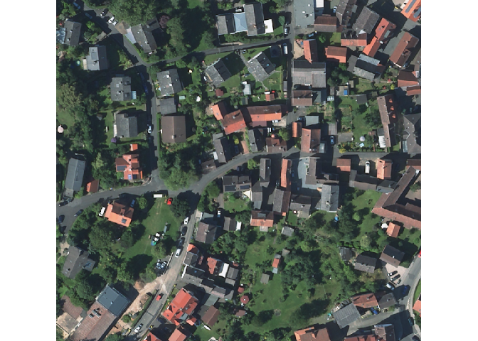
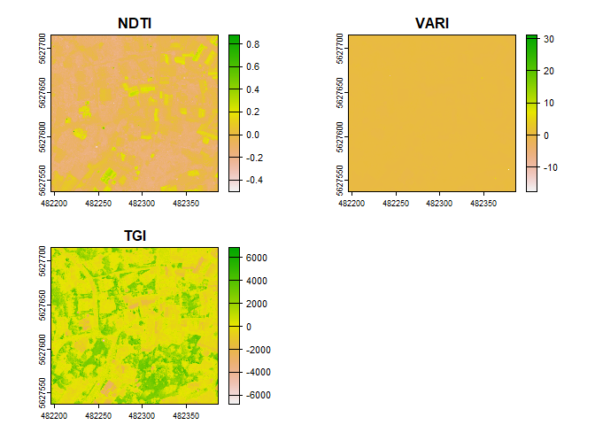

------------------------------------------------------------------------

## Warm up spatial

------------------------------------------------------------------------

This is a follow-along exercise to get familiar with handling spatial
data in R. First we read our geoAI\_setup file to get our directories
and load our packages

    source("geoAI_setup.R")

Now we read our raster excerpt with the rast-function of the terra
package.

    dop <- terra::rast(paste0(envrmt$path_data_level1,"/marburg_dop_excerpt.tif"))

We download building data from open street map and get the polygons.

    buildings <- osmdata::opq(bbox = "marburg de") %>%
      osmdata::add_osm_feature(key = "building") %>%
      osmdata::osmdata_sf()

    buildings <- buildings$osm_polygons

We check the if the projections are the same and transform them to
match.

    terra::same.crs(dop,buildings)

    ## [1] FALSE

    buildings <- sf::st_transform(buildings, terra::crs(dop))

    terra::same.crs(dop,buildings)

    ## [1] TRUE

Now we can take a look at the raster.

    terra::plotRGB(dop)

We can calculate different indices with the given bands.

    # Extract individual bands from the DOP for further analysis
    red <- dop[[1]]
    green <- dop[[2]]
    blue <- dop[[3]]

    # Calculate the Normalized Difference Turbidity Index (NDTI)
    NDTI <- (red -green) / (red + green)
    names(NDTI) <- "NDTI"

    # Calculate the Visible Atmospherically Resistant Index (VARI)
    VARI <- (green - red) / (green + red - blue)
    names(VARI) <- "VARI"

    # Calculate the Triangular Greenness Index (TGI)
    TGI <- -0.5 * (190 * (red - green) - 120 * (red - blue))
    names(TGI) <- "TGI"

    # Combine the indices into a single stack for plotting
    rgbI <- c(NDTI, VARI, TGI)
    terra::plot(rgbI)

Lastly we can combine the original raster with the newly calculated
indicies into object and save it.

    dop_indices <- c(dop, rgbI)
    saveRDS(dop_indices, file.path(envrmt$path_data, "dop_indices.RDS"))
