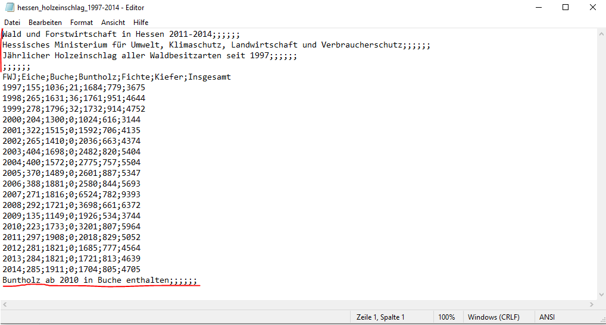
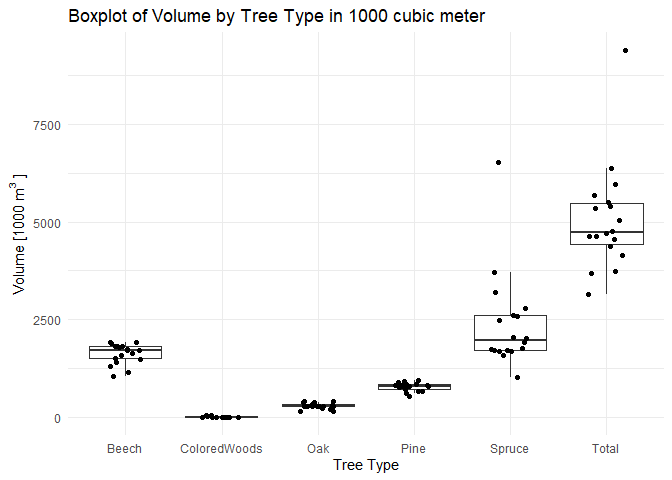
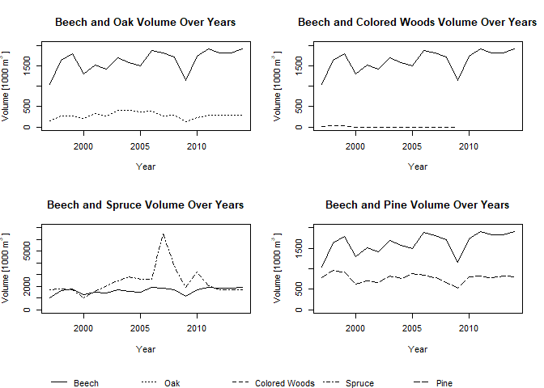

------------------------------------------------------------------------

## Marked Assignment: Read and Plot

------------------------------------------------------------------------

### 1. Task

#### Read the data provided in the Excel file and “isolate” the tabulated information into a data.frame class.

First we take a look at the data: 

We need to read the data with `;` as separator and skip the first 4 and
the last line of the .txt. Also we set year 2010 to 2014 of colored
woods to NA, because they were counted as beechs since 2010.

    data <- read.table(file = "../../data/hessen_holzeinschlag_1997-2014.csv", 
                        header = TRUE, skip =4, sep = ";",     nrow = 18)
    colnames(data) <- c("Year", "Oak", "Beech", "ColoredWoods", "Spruce", "Pine", "Total")
    data[which(data$Year> 2009),4] <- NA
    print(data)

    ##    Year Oak Beech ColoredWoods Spruce Pine Total
    ## 1  1997 155  1036           21   1684  779  3675
    ## 2  1998 265  1631           36   1761  951  4644
    ## 3  1999 278  1796           32   1732  914  4752
    ## 4  2000 204  1300            0   1024  616  3144
    ## 5  2001 322  1515            0   1592  706  4135
    ## 6  2002 265  1410            0   2036  663  4374
    ## 7  2003 404  1698            0   2482  820  5404
    ## 8  2004 400  1572            0   2775  757  5504
    ## 9  2005 370  1489            0   2601  887  5347
    ## 10 2006 388  1881            0   2580  844  5693
    ## 11 2007 271  1816            0   6524  782  9393
    ## 12 2008 292  1721            0   3698  661  6372
    ## 13 2009 135  1149            0   1926  534  3744
    ## 14 2010 223  1733           NA   3201  807  5964
    ## 15 2011 297  1908           NA   2018  829  5052
    ## 16 2012 281  1821           NA   1685  777  4564
    ## 17 2013 284  1821           NA   1721  813  4639
    ## 18 2014 285  1911           NA   1704  805  4705

------------------------------------------------------------------------

### 2. Task

#### Create a simple visualization which gives a quick, temporally non explicit and descriptive statistical overview of the harvest by tree type and as a total over all trees (i.e. a similar kind of information as provided by the summary function).

I want to create a box plot with the ggplot2 package, grouped by the
different tree types. To do that we first need to transform the data
frame from the wide to a long format. For that we can use the tidyr
package.

    library(tidyr)

    data_long <- pivot_longer(data, cols = -Year, names_to = "TreeType", values_to = "Volume")
    head(data_long, n = 12)

    ## # A tibble: 12 × 3
    ##     Year TreeType     Volume
    ##    <int> <chr>         <int>
    ##  1  1997 Oak             155
    ##  2  1997 Beech          1036
    ##  3  1997 ColoredWoods     21
    ##  4  1997 Spruce         1684
    ##  5  1997 Pine            779
    ##  6  1997 Total          3675
    ##  7  1998 Oak             265
    ##  8  1998 Beech          1631
    ##  9  1998 ColoredWoods     36
    ## 10  1998 Spruce         1761
    ## 11  1998 Pine            951
    ## 12  1998 Total          4644

Now we can create the box plot and group it by the tree type.

    library(ggplot2)

    ggplot(data_long, aes(x = TreeType, y = Volume, group = TreeType)) +
      geom_boxplot(outlier.shape = NA) +
      geom_jitter(width = 0.2) +         
      theme_minimal()+
      labs(x = "Tree Type", y = expression(Volume~"[1000"~m^3~"]"), 
           title = "Boxplot of Volume by Tree Type in 1000 cubic meter")

------------------------------------------------------------------------

### 3. Task

#### Create another visualization which - in the same figure panel - shows how each beech harvest over the time span is related to each of the oak, pine, spruce and colored wood harvests in a 2 by 2 grid (i.e. arrange the figures in a 2 columns and 2 rows layout).

This time we will use base R to create the plots. First we create a
Layout to arrange to plots in a 2x2 grid, but also add a third row for
the legend (so technicly a 2x3 grid). For that we use the
layout-function. Inside that function we create a matrix to create
different cells for the layout. Because the whole last row should
contain the legend we count from 1 to 5 and count 5 two times. We define
the number of rows and columns of the layout and adjust the heights of
the different rows. Then we can create the plots inside of the layout.
At the end we add the legend to the last row.

    layout(matrix(c(1, 2, 3, 4, 5, 5), 3, 2, byrow = TRUE), heights = c(2, 2, 0.25))

    line_types <- c("solid", "dotted", "dashed", "dotdash", "longdash")

    plot(data$Year, data$Beech, type = "l", lty = line_types[1], ylim = c(0, 2000),
         xlab = "Year", ylab = expression(Volume~"[1000"~m^3~"]"), main = "Beech and Oak Volume Over Years")
    lines(data$Year, data$Oak, lty = line_types[2])

    plot(data$Year, data$Beech, type = "l", lty = line_types[1], ylim = c(0, 2000), 
         xlab = "Year", ylab = expression(Volume~"[1000"~m^3~"]"), main = "Beech and Colored Woods Volume Over Years")
    lines(data$Year, data$ColoredWoods,
          lty = line_types[3])

    plot(data$Year, data$Beech, type = "l", lty = line_types[1], ylim = c(0, 7000),
         xlab = "Year", ylab = expression(Volume~"[1000"~m^3~"]"), main = "Beech and Spruce Volume Over Years")
    lines(data$Year, data$Spruce, lty = line_types[4])

    plot(data$Year, data$Beech, type = "l", lty = line_types[1], ylim = c(0, 2000),
         xlab = "Year", ylab = expression(Volume~"[1000"~m^3~"]"), main = "Beech and Pine Volume Over Years")
    lines(data$Year, data$Pine, lty = line_types[5])

    par(mar = c(0, 0, 0, 0))

    plot.new()
    legend("bottom", inset = c(0, -0.2), legend = c("Beech", "Oak", "Colored Woods", "Spruce", "Pine"), 
           bty = "n",title = NA, 
           lty = c(line_types[1], line_types[2], line_types[3], line_types[4], line_types[5]), 
           horiz = TRUE)

------------------------------------------------------------------------

### 4. Task

#### Include your opinion on what could be the key message of these figures in two sentence max.

The data shows a notable decrease in spruce harvest volumes in 2007, a
result of its vulnerability to factors such as the Kyrill storm, bark
beetle infestations, and elevated temperatures. In contrast, other nativ
tree species did not exhibit a similar increase in harvest volume that
year, underscoring the importance of tailoring forest management to the 
unique responses of different species to environmental stressors and climate change.

------------------------------------------------------------------------
