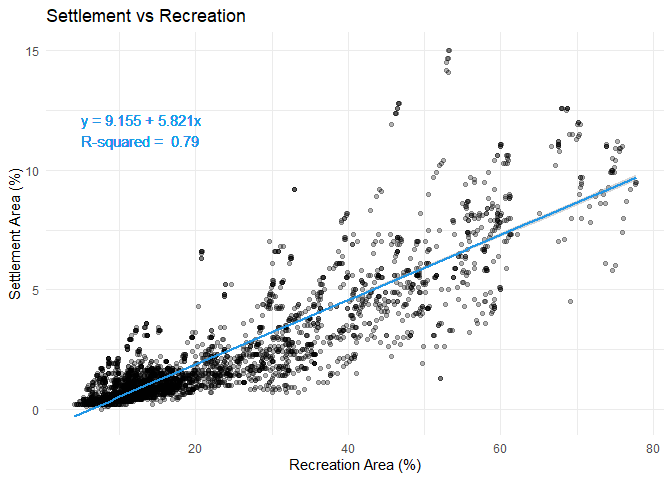
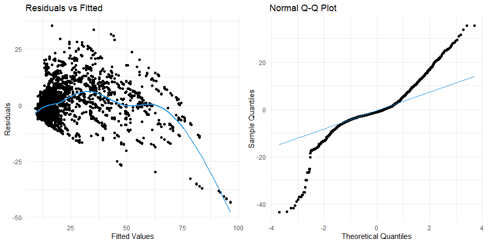
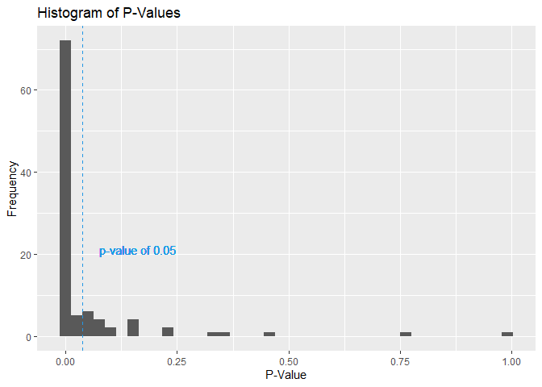

------------------------------------------------------------------------

## Marked Assignment: Recreation vs. Settlement

------------------------------------------------------------------------

First we simply read the .RDS file provided.

    data <- readRDS(file = "../../data/lu_clean.RDS")

------------------------------------------------------------------------

### Linear Model

Here we calculate the linear model. After calculating the model, we
create the equation to be displayed within the plot. Lastly we create
the plot with the ggplot package.

    library(ggplot2)

    model <- lm(Settlement ~ Recreation, data)

    # Calculate model coefficients for the label
    intercept <- round(coef(model)[1], 3)
    slope <- round(coef(model)[2], 3)
    equation_label <- paste0("y = ", intercept, " + ", slope, "x")
    r_squared <- summary(model)$r.squared
    label <- paste(equation_label, "\nR-squared = ", round(r_squared, 2))

    # Create ggplot
    ggplot(data, aes(x = Settlement, y = Recreation)) +
      geom_point(alpha = 0.3) +
      geom_smooth(method = "lm", color = 4) +
      geom_text(aes(label = as.character(label), x = 5, y = 11), hjust = 0, vjust = 0, color = 4) +
      theme_minimal() +
      labs(title = "Settlement vs Recreation", x = "Recreation Area (%)", y = "Settlement Area (%)")

    ## `geom_smooth()` using formula = 'y ~ x'

### Minimum assumptions

Now we check for the homogeneity of the variance of residuals
(homoscedasticity) and the normality of the residuals. For this, we plot
the fitted values against the residuals and create a QQ-Plot.

    library(gridExtra)

    # Plot 1: Residuals vs Fitted
    p1 <- ggplot(data.frame(Fitted = fitted(model), Residuals = residuals(model)),  aes(x = Fitted, y = Residuals)) +
      geom_point() +
      geom_smooth(se = FALSE, color = 4) +
      labs(title = "Residuals vs Fitted", x = "Fitted Values", y = "Residuals") +
      theme_minimal()

    # Plot 2: Normal Q-Q Plot
    p2 <- ggplot(data.frame(residuals = residuals(model)), aes(sample = residuals)) +
      stat_qq() +
      stat_qq_line(color = 4) +
      labs(title = "Normal Q-Q Plot", x = "Theoretical Quantiles", y = "Sample Quantiles") +
      theme_minimal()

    # Arrange the plots side by side
    grid.arrange(p1, p2, ncol = 2)

The plots show that the residuals are neither homoscedastic nor normally
distributed, so we should have used a generalized model.

### Evaluation of the Shapiro-Wilk test

Now we evaluate how often a normal distribution test on the residuals
would reject it’s null-hypothesis if a regression model is not computed
on the entire data set but 100 regression models are computed on 100
sub-samples of the data set. The following code creates 100 random
subsets with 50 Objects of the full data frame. For each subset we
calculate a linear model. We use the Shapiro-Wilk test to test the
residuals of the models for normal distribution. The p-values are being
saved in a data frame and displayed in a histogram. The null hypothesis
of the Shapiro-Wilk test is that the data is normally distributed. The
p-value states the probability of the null hypothesis.

    random_subsets <- list()
    results <- data.frame(Iteration = integer(0), P_Value = numeric(0))

    # Set the seed once for reproducibility
    set.seed(123) 

    for (i in 1:100) {
      random_indices <- sample(nrow(data), 50)
      random_subsets[[i]] <- data[random_indices, ]
      
      linear_model <- lm(Settlement ~ Recreation, random_subsets[[i]])
      p_value <- shapiro.test(resid(linear_model))$p.value
      results <- rbind(results, data.frame(Iteration = i, P_Value = p_value))
    }

    ggplot(results, aes(x = P_Value)) +
      geom_histogram(bins = 40) +
      geom_vline(xintercept = 0.0375, color = 4, linetype = "dashed") +
      labs(title = "Histogram of P-Values", x = "P-Value", y = "Frequency")+
      geom_text(aes(label = "p-value of 0.05", x = 0.075, y = 20), hjust = 0, vjust = 0, color = 4)

In 77 of the 100 cases the p-value of the Shapiro-Wilk test is beneath
or equal 0.05 which matches with the graphical analysis we did before.
However, in 23 cases, the null hypothesis cannot be rejected. The
variability in the test results across different subsets highlights the
influence of sample size and selection on the performance of normality
tests like Shapiro-Wilk and shows how randomness in sub sampling can
lead to subsets that are not representative of the entire dataset.
